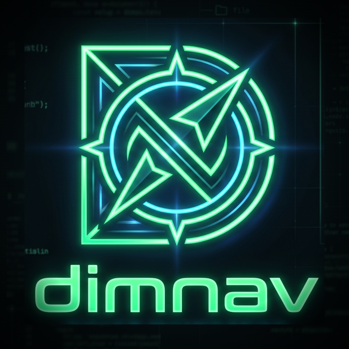

<div align="center">



**A fast, keyboard-first two-panel file manager for macOS.**

In the Norton Commander / Far Manager / Midnight Commander lineage — two panels,
function keys, and your hands never leaving the keyboard.

[Download][latest] · [Website](https://dimnav.com) · [Shortcuts](#shortcuts) · [Building](#building)

[](https://github.com/pichugin/dimnav/actions/workflows/ci.yml)
[](LICENSE)

</div>

---

## Install

Download the latest `.dmg` from the [releases page][latest], open it, and drag
dimnav to Applications.

Builds are signed with a Developer ID certificate and notarized by Apple, so
they open without Gatekeeper warnings. Requires **macOS 10.15** or later; the
download is a universal binary that runs natively on both Apple Silicon and
Intel.

## Why

Finder is fine for browsing and bad at moving things. A two-panel manager makes
the common operation — *take these files from here and put them there* — a
single glance and one keystroke, because both the source and the destination are
already on screen.

dimnav is that, built as a native app rather than a web page in a wrapper: all
the logic lives in a Rust core, and the UI is a thin rendering layer over a typed
IPC contract.

## Features

- **Two panels**, each with its own view mode (1–3 columns or a detailed single
  column), sort order, and hidden-file setting — all remembered across restarts.
- **One-key file operations** — copy, move, rename, mkdir, delete — that run
  asynchronously, report progress, and can be cancelled mid-flight.
- **Collision handling** in the Far Manager idiom: skip, overwrite, or
  skip/overwrite all, with an editable destination path.
- **Move to Trash** as a per-operation checkbox, off by default, so a delete is a
  delete unless you say otherwise.
- **Built-in terminal** with command history, sharing the panel's working
  directory.
- **Built-in viewer and editor** (F3/F4), including a hex mode.
- **Quick search** to jump to a file by typing part of its name.
- **Privilege escalation through the OS**, when an operation needs it — the app
  shows the native authorization prompt and never handles your password.

## Shortcuts

Press <kbd>F1</kbd> in the app for the full, always-current list — it is
generated from the live keymap, so it cannot drift from what the keys actually
do.

| Key | Action |
| --- | --- |
| <kbd>Tab</kbd> | Switch panel |
| <kbd>↑</kbd> <kbd>↓</kbd> <kbd>←</kbd> <kbd>→</kbd> | Move the cursor (columns wrap and paginate) |
| <kbd>Enter</kbd> | Enter directory / open file |
| <kbd>Backspace</kbd> | Go to parent, landing on the folder you just left |
| <kbd>Space</kbd> | Toggle selection |
| <kbd>F3</kbd> / <kbd>F4</kbd> | View / edit |
| <kbd>F5</kbd> / <kbd>F6</kbd> | Copy / move |
| <kbd>F7</kbd> / <kbd>F8</kbd> | New folder / delete |
| <kbd>⌘F</kbd> | Quick search |
| <kbd>⌘T</kbd> | Focus the terminal |
| <kbd>⌃H</kbd> | Toggle hidden files |
| <kbd>⌃1</kbd>–<kbd>⌃4</kbd> | Panel view mode |
| <kbd>F1</kbd> | Help |

## Building

Requires [Rust](https://rustup.rs) and [Node](https://nodejs.org); the exact
versions are pinned in `rust-toolchain.toml` and `.nvmrc`.

```bash
git clone https://github.com/pichugin/dimnav.git
cd dimnav
npm install
npm run tauri dev      # run in development
npm run tauri build    # produce a .app and .dmg
```

Other useful commands:

```bash
cargo test --workspace   # the core's test suite
npm run check            # typecheck the Svelte frontend
npm run bindings         # regenerate the typed IPC bindings after changing Rust DTOs
npm run bump 0.2.0       # bump the version everywhere it is written down
```

### Layout

| Path | What it is |
| --- | --- |
| `crates/fm-core` | The platform-agnostic core: filesystem engine, navigation and selection state machine, file-operation pipeline, config, help, plugin extension points. Depends on Tauri **never**. |
| `src-tauri` | The Tauri adapter — command handlers and event plumbing, and nothing else. |
| `src` | The Svelte renderer. Holds no business logic; see `CLAUDE.md`. |
| `docs/SPEC.md` | The full specification. |
| `docs/FEATURES.md` | What is built versus planned. |

## Contributing

Bug reports and pull requests are welcome — see [CONTRIBUTING.md](CONTRIBUTING.md).
Please read `docs/SPEC.md` first if you are changing behaviour; a lot of the
apparent quirks are specified deliberately.

## Support

dimnav is free and open source. If it saves you time, you can
[sponsor its development](https://github.com/sponsors/pichugin).

## License

[MIT](LICENSE) © Dmitry Pichugin

[latest]: https://github.com/pichugin/dimnav/releases/latest
